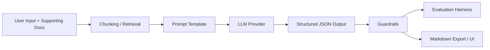
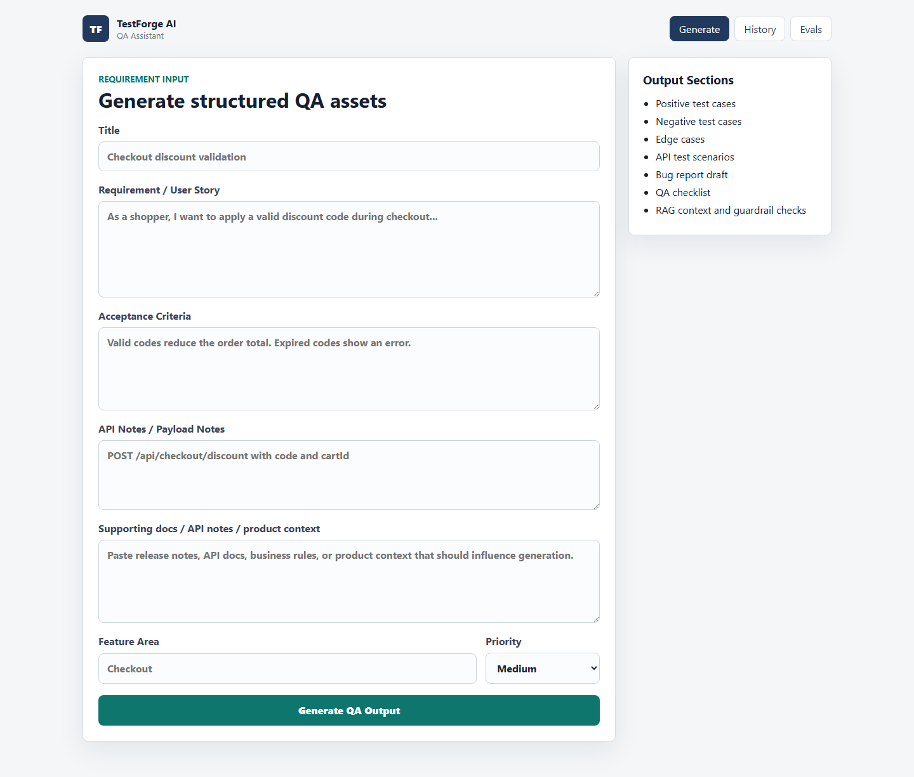
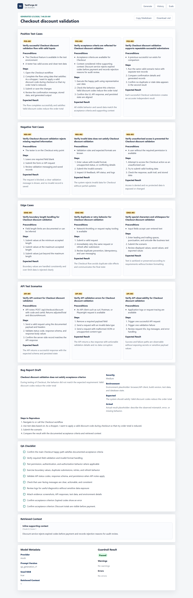
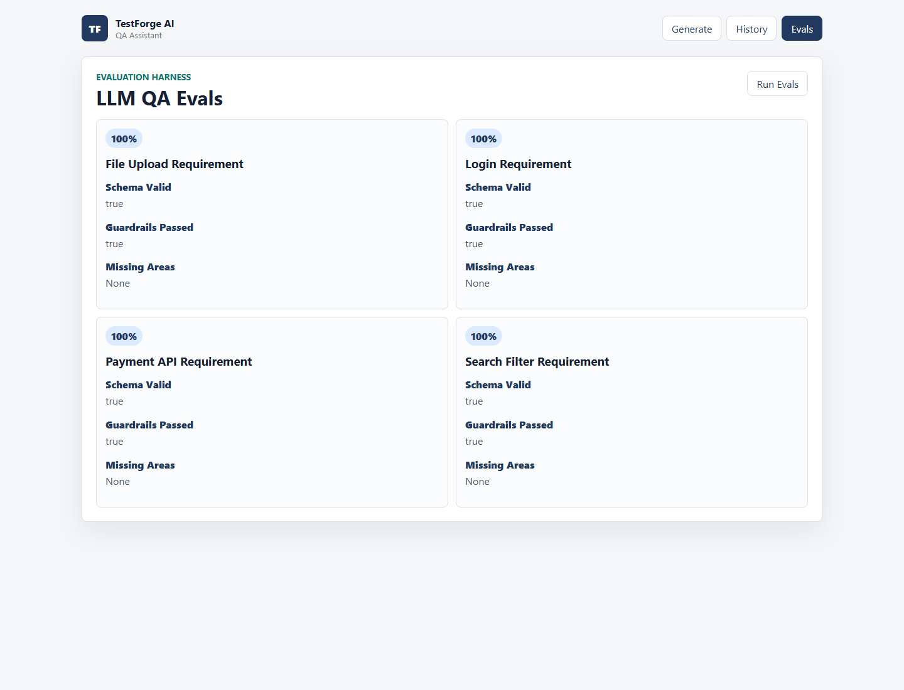

# TestForge AI: LLM-Powered QA Agent with RAG + Evals

TestForge AI is a full-stack QA/SDET portfolio project that converts requirements, acceptance criteria, API notes, and supporting documentation into structured QA deliverables. The app keeps mock mode as the default, so it runs without paid APIs, while also providing an optional OpenAI provider for real LLM generation.

## LLM Engineering Highlights

- Prompt-template driven QA generation with versioned prompts in `backend/app/prompts`.
- Lightweight RAG flow using local document chunking and keyword-overlap retrieval.
- Provider abstraction with deterministic `MockLLMProvider` by default and optional `OpenAIProvider`.
- Pydantic structured output validation for test cases, bug drafts, retrieved context, metadata, and guardrails.
- Guardrail checks for missing sections, empty coverage categories, duplicate test titles, malformed bug drafts, and hallucinated API endpoints.
- Evaluation harness with fixture-based scoring for coverage, schema validity, and guardrail pass/fail.
- CI-ready validation template for backend tests, frontend tests, and frontend production build.

## What It Generates

- Positive test cases
- Negative test cases
- Edge cases
- API test scenarios
- Bug report draft
- QA checklist
- Retrieved context
- Model metadata
- Guardrail result
- Markdown export

## Architecture



## RAG Flow

1. Add product docs, API notes, release notes, or business rules with `POST /api/documents`.
2. The backend splits documents into local chunks and stores them in SQLite.
3. During `POST /api/generate`, the backend builds a retrieval query from the title, requirement, acceptance criteria, API notes, and feature area.
4. The RAG service retrieves top matching chunks with keyword overlap.
5. Retrieved context is passed to the LLM provider and returned in the generation response.

This MVP intentionally uses keyword retrieval instead of paid embeddings so the project is easy to run in interviews, CI, and portfolio reviews.

## Prompt Versioning

Prompts live in:

```text
backend/app/prompts/
|-- qa_generation_v1.txt
`-- bug_report_v1.txt
```

`PROMPT_VERSION=qa_generation_v1` controls the QA generation prompt. The prompt instructs the provider to return valid JSON only, use retrieved context when present, avoid inventing endpoints, and generate realistic QA coverage.

## Structured Output Validation

The generation response preserves the original MVP fields and adds LLM engineering metadata:

```json
{
  "positive_test_cases": [],
  "negative_test_cases": [],
  "edge_cases": [],
  "api_test_scenarios": [],
  "bug_report_draft": {},
  "qa_checklist": [],
  "retrieved_context": [],
  "model_metadata": {
    "provider": "mock",
    "prompt_version": "qa_generation_v1",
    "used_rag": true,
    "retrieved_context_count": 1
  },
  "guardrail_result": {
    "passed": true,
    "warnings": [],
    "errors": []
  }
}
```

## Guardrails

The backend guardrail layer checks:

- Missing required output sections
- Empty positive, negative, or edge case arrays
- Duplicate test case titles
- Malformed bug report drafts
- Potential hallucinated API endpoints in generated API scenarios

Endpoint hallucination detection is intentionally simple: it extracts endpoint-like strings from API notes and retrieved context, then compares them with endpoint-like strings in generated API test scenarios.

## Evaluation Harness

Eval fixtures live in `backend/evals`:

```text
login_requirement.json
payment_api_requirement.json
search_filter_requirement.json
file_upload_requirement.json
```

`POST /api/evals/run` runs all eval fixtures with the mock provider and returns:

- `schema_valid`
- `includes_positive_cases`
- `includes_negative_cases`
- `includes_edge_cases`
- `includes_api_scenarios`
- `includes_bug_report`
- `guardrails_passed`
- `coverage_score`
- `missing_areas`

## Mock Mode vs OpenAI Mode

Mock mode is the default and requires no API key:

```env
AI_PROVIDER=mock
PROMPT_VERSION=qa_generation_v1
RAG_RETRIEVAL_TOP_K=3
```

Optional OpenAI mode:

```env
AI_PROVIDER=openai
OPENAI_API_KEY=your_key_here
OPENAI_MODEL=gpt-4o-mini
PROMPT_VERSION=qa_generation_v1
```

If `AI_PROVIDER=openai` is set without `OPENAI_API_KEY`, the app falls back to mock mode. The app should never fail just because a paid API key is missing.

## Tech Stack

| Area | Technology |
| --- | --- |
| Frontend | React, Vite, TypeScript |
| Backend | Python, FastAPI, Pydantic |
| Database | SQLite |
| LLM layer | Provider abstraction, prompt templates, optional OpenAI SDK |
| RAG | Local chunking and keyword-overlap retrieval |
| Backend tests | Pytest, FastAPI TestClient |
| Frontend tests | Vitest, React Testing Library, jsdom |
| CI/CD | GitHub Actions-ready workflow template |
| Export | Markdown |

## API Endpoints

| Method | Endpoint | Purpose |
| --- | --- | --- |
| `GET` | `/health` | API health check |
| `POST` | `/api/generate` | Generate and save structured QA output |
| `GET` | `/api/generations` | Return previous generated outputs |
| `GET` | `/api/generations/{id}` | Return one generated output |
| `GET` | `/api/generations/{id}/export` | Return Markdown export |
| `POST` | `/api/documents` | Index supporting document text for RAG |
| `GET` | `/api/documents` | Return indexed document summaries |
| `POST` | `/api/evals/run` | Run the evaluation harness |

## Sample Input

```json
{
  "title": "Checkout discount validation",
  "requirement": "As a shopper, I want to apply a valid discount code during checkout so that my order total is reduced.",
  "acceptance_criteria": "Valid discount codes reduce the order total. Expired codes show an error. Discount totals are visible before payment.",
  "api_notes": "POST /api/checkout/discount with code and cartId. Returns adjustedTotal and discountAmount.",
  "feature_area": "Checkout",
  "priority": "High",
  "supporting_context": "Discount service rejects expired codes before payment and records the rejection reason for audit review."
}
```

More examples:

- [docs/sample-input.json](docs/sample-input.json)
- [docs/sample-output.md](docs/sample-output.md)
- [docs/qa-strategy.md](docs/qa-strategy.md)

## Run Backend

```bash
cd backend
python -m venv .venv
.venv\Scripts\activate
pip install -r requirements.txt
uvicorn app.main:app --reload
```

Backend URL: `http://localhost:8000`

## Run Frontend

```bash
cd frontend
npm install
npm run dev
```

Frontend URL: `http://localhost:5173`

## Run Tests

Backend:

```bash
cd backend
pytest
```

Frontend:

```bash
cd frontend
npm test
npm run build
```

## Run Evals

With the backend running:

```bash
curl -X POST http://localhost:8000/api/evals/run ^
  -H "Content-Type: application/json" ^
  -d "{}"
```

On macOS/Linux, replace `^` with `\`.

The frontend also includes an `Evals` page that calls the same endpoint.

## Screenshots

### Generate Page



### Results Page with RAG, Metadata, and Guardrails



### Eval Dashboard



To refresh screenshots after UI changes, start the backend and frontend, then run:

```bash
cd frontend
npm run screenshots
```

## Project Structure

```text
testforge-ai/
|-- backend/
|   |-- app/
|   |   |-- prompts/
|   |   |-- services/
|   |   |   |-- llm_provider.py
|   |   |   |-- mock_llm_provider.py
|   |   |   |-- openai_provider.py
|   |   |   |-- rag_service.py
|   |   |   |-- guardrail_service.py
|   |   |   `-- eval_service.py
|   |   |-- main.py
|   |   |-- schemas.py
|   |   `-- database.py
|   |-- evals/
|   |-- tests/
|   `-- requirements.txt
|-- frontend/
|   `-- src/
|-- docs/
|   |-- screenshots/
|-- docs/github-actions-ci.yml
`-- README.md
```

## CI Template

A GitHub Actions workflow template is included at [docs/github-actions-ci.yml](docs/github-actions-ci.yml). Copy it to `.github/workflows/ci.yml` once your GitHub token or app has workflow permission.

The workflow runs:

- Backend dependency install
- `pytest`
- Frontend `npm ci`
- `npm test`
- `npm run build`

Local E2E smoke test:

```bash
cd frontend
npm run test:e2e
```

Run it while the backend and frontend are already running.

## CV Bullet Examples

**TestForge AI: LLM-Powered QA Agent with RAG + Evals | FastAPI, React, Python, LLM APIs, RAG, Pydantic, Pytest, CI-ready GitHub Actions**

- Built an LLM-powered QA generation platform that converts requirements, acceptance criteria, and supporting documentation into structured test cases, edge scenarios, API checks, bug reports, and QA checklists using prompt templates, retrieval-augmented context, and schema validation.
- Implemented a lightweight evaluation and guardrail layer covering output schema validity, duplicate test detection, missing coverage categories, hallucinated API endpoint checks, Markdown export, and CI-ready regression behavior.

## Current Limitations

- RAG uses keyword overlap rather than embeddings.
- The OpenAI provider is optional and not required for CI.
- There is no authentication or multi-user history separation.
- Uploaded file parsing is intentionally limited to pasted text or text/Markdown content for the MVP.

## Future Improvements

- Add embeddings and a vector database such as ChromaDB.
- Add Playwright end-to-end smoke tests against a running backend and frontend.
- Add editable test case review before export.
- Add JSON/CSV exports for test management tools.
- Add provider quality comparison reports across eval runs.
